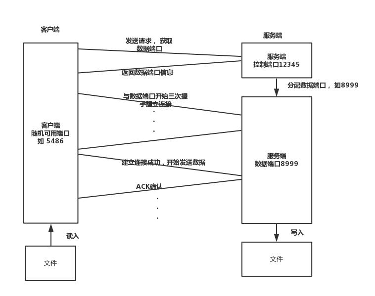

# LFTP Design

设计文档

---
## 简介
LFTP是一个采用python3实现的基于UDP传输协议的可靠文件传输工具

---
## 特点

- 基于UDP
  - 采用`python3`编程语言，socket的类型均为`socket(AF_INET,SOCK_DGRAM)`实现
- 实现100%可靠性传输
  - 使用SR（选择重传）协议保证所有报文都正确接收
- 实现流量控制
  - 使用接收者通知发送者接收缓存大小来反馈发送窗口大小
- 实现拥塞控制
  - 根据网络情况动态调整发送窗口大小。
- 实现并发传输
  - 使用多个服务线程，满足多个用户同时上传或者下载的需求
- 支持大文件传输且不需要过多内存
  - 切块传输

---

## 具体设计

### 项目结构：

项目树：
```bash
.
├── docs
│   ├── Design-doc.md
│   └── Test-doc.md
├── README.md
└── src
    ├── Client
    │   └── client.py   # 客户端
    ├── Helper
    │   ├── __init__.py
    │   ├── LFTPMessage.py    # 封装传递的包
    │   ├── LFTPRecvWindow.py # 接收窗口
    │   └── LFTPSendWindow.py # 发送端口
    ├── Server
    │   └── server.py   # 服务端
    └── Utils
        └── Log.py      # 记录日志

```

### 基本流程

流程参考FTP被动模式，首先客户端会获取一个随机端口（python的socket指定），然后向我们指定定的服务端端口发送请求命令，然后服务端主控制线程会新开一个数据线程，分配一个数据传输端口，并且把端口号发送给客户端，然后客户端向这个数据传输端口获取文件数据或者发送文件数据。这种方式保证了多个客户端可以同时连接服务器进行数据传输。

#### 客户端上传文件到服务端



具体工作过程：

- 客户端向服务端请求发送文件，获取服务端的数据端口
- 服务端接收到发送文件请求，从空闲的地址池中选择一个端口，新开一个数据线程，在这个端口上监听接收的数据
- 客户端接收到服务端传来的数据端口，向该数据端口发起连接
- 若连接成功，客户端向服务端开始发送文件分组信息
- 服务端接收到相应的分组，发回相应的ACK确认（采用累积确认）
- 客户端接收到相应的ACK，做出调整
- 客户端接收到所有分组的ACK，结束进程
- 服务端超时5s（有可能需要ACK相应的信息，即使收到了全部的包）之后同样关闭端口


#### 客户端从服务器下载文件

下载的过程和上传的过程类似，只是在建立连接之后，由数据方，也就是服务端开始发数据分组


- 客户端向服务端请求发送文件，获取服务端的数据端口
- 服务端接收到发送文件请求，从空闲的地址池中选择一个端口，新开一个数据线程，在这个端口上监听接收的数据
- 客户端接收到服务端传来的数据端口，向该数据端口发起连接
- 若连接成功，服务端向客户端开始发送文件分组信息
- 客户端接收到相应的分组，发回相应的ACK确认（采用累积确认）
- 服务端接收到相应的ACK，做出调整（cwnd和rwnd）
- 服务端接收到所有分组的ACK，结束该服务线程，关闭端口
- 客户端超时5s（有可能需要ACK相应的信息，即使收到了全部的包）之后结束进程

### 相关细节实现

#### 文件相关信息的接收和发送

这里的文件相关信息指示的是文件名称或文件大小等信息，原先打算在每个包的首部加上该字段，存储文件相关信息，后来发现可以在三次握手期间将文件信息发与服务端（或者从服务端获取该相关信息）

#### 可靠性的实现

这里参考TCP的重传和确认，采用SR（选择重传）和累积确认的结合方式，当收取到相应的数据包，接收方会发送ACK包，与SR不同的是，这里ACK包中的确认号ACKnum是选择最小的未接收序列号。

#### 拥塞控制实现

在接收到ACK的时候：

- 正确的ACK，增加窗口大小：
    - 慢启动阶段：cwnd <= ssthresh: cwnd = cwnd + 1 
    - 拥塞避免阶段：cwnd > ssthresh: cwnd = cwnd + 1/cwnd
- 冗余的ACK，三次冗余将重传 + 减少窗口大小
    - ssthresh = cwnd / 2
    - cwnd = cwnd/2 + 3
- 超时，重传 + 减少窗口大小
    - ssthresh = cwnd / 2
    - cwnd = 1

#### 流量控制实现

在ACK确认分组信息头部加上接收窗口空余数（可用数），发送方接收到该确认分组之后将根据该字段，动态调整发送窗口的长度

#### 并发多客户上传或下载的实现

服务端会有一个主控制线程，每受到新的客户端的请求（UPLOAD/DOWNLOAD），它都会从空闲端口池中取出空闲端口，新建一个数据线程去监听该端口，然后主控制线程会告诉客户端去跟新的数据线程连接并传递信息。

#### 大文件读写的实现

python3读取文件的函数file.read(size)，已经自动帮我们做了缓存机制，所以我们可以直接进行读写而不必进行数据分块处理，但需要注意的是，不能一次性read()整个文件，不然会将整个文件读入内存中，大文件会直接将内存撑爆，而要使用read(size),通过大小为size的缓存，实现对文件的分块读取（每次只读取size）。

### 