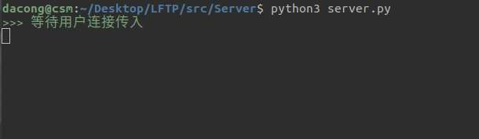
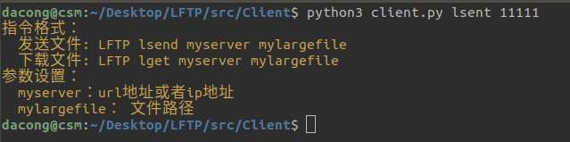
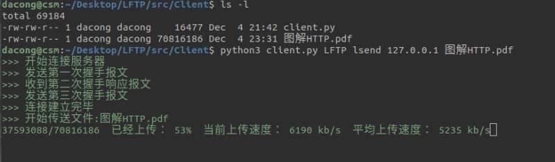
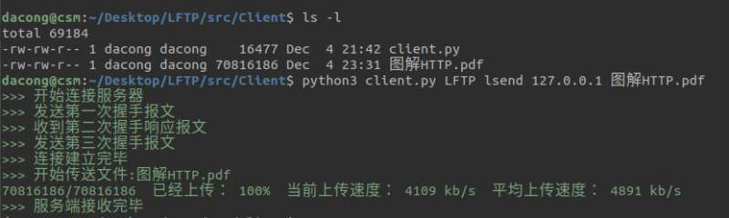
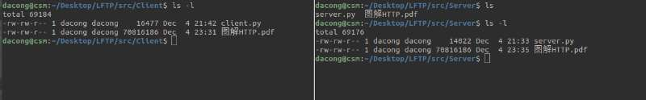
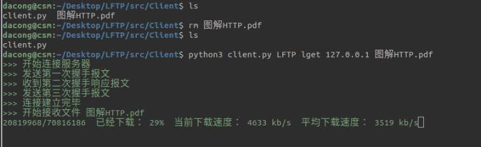
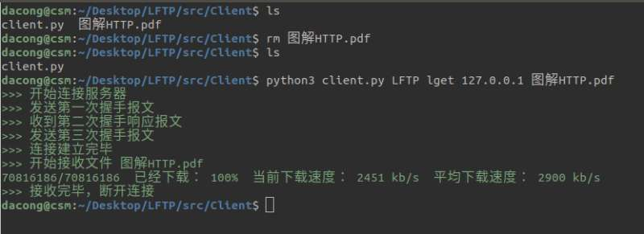
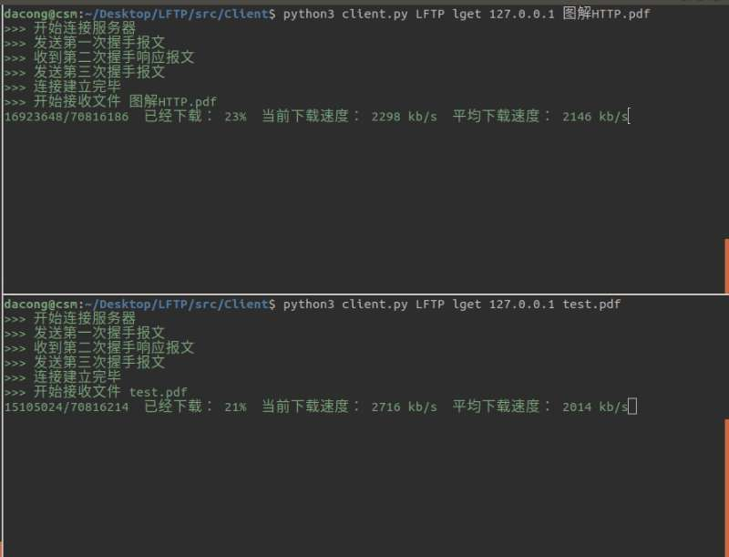
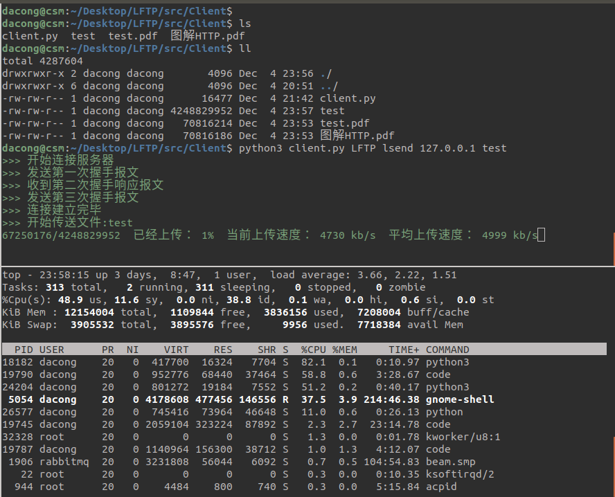

# LFTP Test

测试文档

---

## 局域网下进行测试

### 服务端
命令行开启服务(默认跑在123456端口)

```bash
$ python3 server.py
```



### 客户端
**命令错误会有相应的提示信息**




**发送数据**
使用指令`LFTP lsend 127.0.0.1 filepath` 进行上传相应的文件

这里我上传了一个几十MB的pdf文件：



上传结束：



对比服务端和客户端的文件大小：



可以发现客户端和服务端的文件子节数相同，上传成功


**接收数据**
使用指令`LFTP lget 127.0.0.1 filepath` 进行上传相应的文件

这里我删除刚才上传的了的pdf文件， 再进行下载：



下载结束：



对比服务端和客户端的文件大小：


可以发现客户端和服务端的文件子节数相同，下载成功

**测试并行下载**



上图可以看出服务端支持两个客户端同时进行文件的下载


## 互联网下进行测试
### **测试环境**
服务器：腾讯云

配置：2核2G

带宽：上行1Mbps，下行8Mbps

系统：ubuntu 16.04 64位

运行环境：Python3

公网IP：119.29.204.118 (广州)


##大文件下载
这里在局域网下进行了大文件测试

可以看出，即使上传超过4GB，内存并没有过多占有，这里只是占用了 0.1% 的内存


