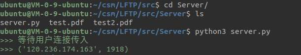
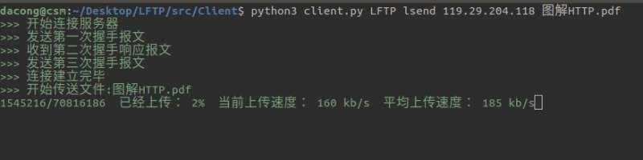
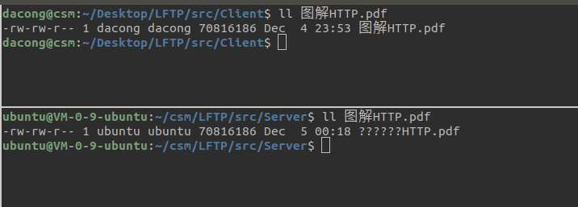
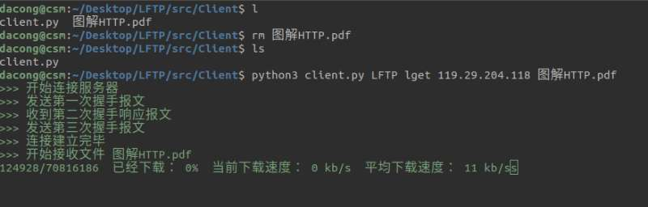
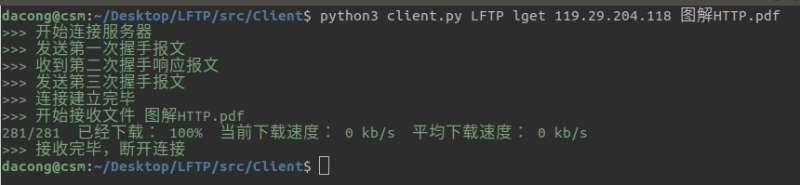
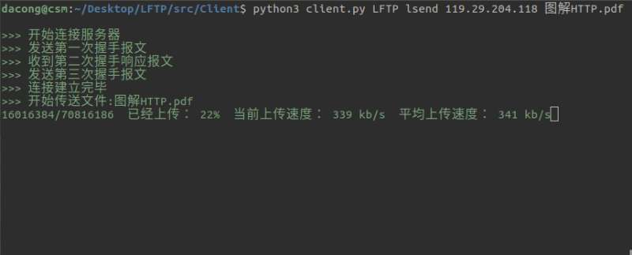
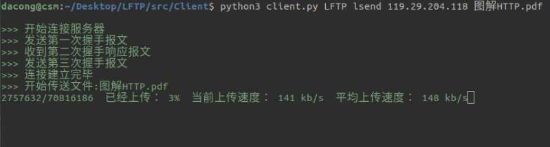
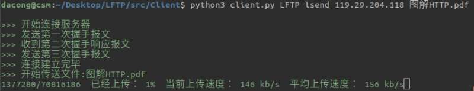

# LFTP Test

测试文档

---

## 局域网下进行测试

### 服务端
命令行开启服务(默认跑在123456端口)

```bash
$ python3 server.py
```


### 客户端
**命令错误会有相应的提示信息**


**发送数据**
使用指令`LFTP lsend 127.0.0.1 filepath` 进行上传相应的文件

这里我上传了一个几十MB的pdf文件：


上传结束：


对比服务端和客户端的文件大小：


可以发现客户端和服务端的文件子节数相同，上传成功


**接收数据**
使用指令`LFTP lget 127.0.0.1 filename` 进行下载相应的文件

这里我删除刚才上传的了的pdf文件，再进行下载：


下载结束：


对比服务端和客户端的文件大小：


可以发现客户端和服务端的文件子节数相同，下载成功

**测试并行下载**


上图可以看出服务端支持两个客户端同时进行文件的下载


## 互联网下进行测试
### **测试环境**
服务器：腾讯云

配置：2核2G

带宽：上行1Mbps，下行8Mbps

系统：ubuntu 16.04 64位

运行环境：Python3

公网IP：119.29.204.118 (广州)

### 服务端

命令行开启服务(默认跑在123456端口)

```bash
$ python3 server.py
```




### 客户端
**发送数据**
使用指令`LFTP lsend 119.29.204.118 filepath` 进行上传相应的文件

跟在局域网下相似，这里我上传了一个几十MB的pdf文件：


上传结束


对比一下接收到的文件和源文件



可以发现客户端和服务端的文件子节数相同，上传成功

**接收数据**
使用指令`LFTP lget 119。29.204.118 filename` 进行下载相应的文件

这里我删除刚才上传的了的pdf文件，再进行下载：



下载结束：



对比服务端和客户端的文件大小：


可以发现客户端和服务端的文件子节数相同，下载成功

**测试并行下载**
在局域网下测试：


上图可以看出服务端成功支持两个客户端同时进行文件的下载


## 拥塞控制测试
因为局域网内的带宽过大，难以看出拥塞控制测试的效果，因此这里使用互联网环境，在云服务器上1Mbps的带宽下同时下载文件

首先让一个客户端先开启下载，可以达到300KB/s的速度:



然后，再连接一个客户端，可以看到，此时速度都降低到150KB/s的速度。约为原来的1/2:





## 流量控制测试
因为文件写入的速度远快于数据在网络中的传输数度，流量控制并没有很明显的表现，所以此处并没有流量控制测试的相关截图。

## 大文件下载测试
这里在局域网下进行了大文件测试

可以看出，即使上传超过4GB，内存并没有过多占有，这里只是占用了 0.1% 的内存.


